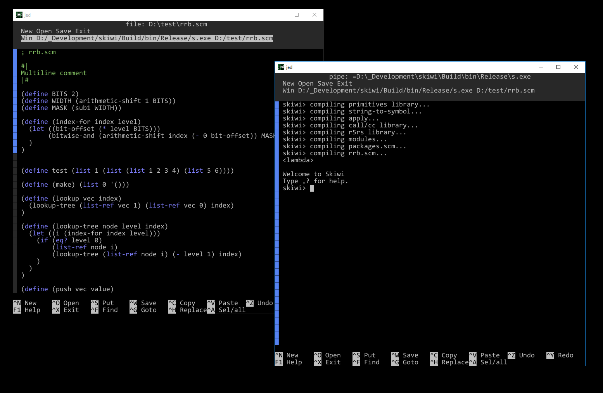

# jed

Jan's editor: a minimalist text editor inspired by Acme and Nano.

building
--------
### building instructions for Windows

1.) Download and build [SDL2](https://www.libsdl.org/) (and install in C:\program files\sdl2 or any other location but then you'll need to update the CMakeLists.txt files with this new location)

2.) Download and build [freetype-2.4.8](https://www.freetype.org/download.html) for x64bit using the sln file provided in folder builds/win32/vc2010

3.) Download and build [ttf-2.0.15](https://www.libsdl.org/projects/SDL_ttf/) using CMake, point to the correct freetype location. Press "Advanced" in CMakeGui to set the links to the lib files if these links are not visible by default.

4.) Install to C:\program files\sdl_ttf (or any other location but then you'll need to update the CMakeLists.txt files with this new location)

5.) Copy the freetype lib files also to the sdl_ttf lib folder as your app needs to link with those too.

6.) Use CMake to make a Visual Studio solution file for this project and build.

### building instructions for Linux

1.) Install SDL2: `sudo apt-get install libsdl2-dev`

2.) Install SDL2-ttf: `sudo apt-get install libsdl2-ttf-dev`

3.) Use CMake to generate a makefile, and run make in the build folder.

### building instructions for MacOs

1.) Download the SDL2 framework from the [SDL2](https://www.libsdl.org/) website and install in /Library/Frameworks/

2.) Download the SDL2-ttf framework from the [ttf-2.0.15](https://www.libsdl.org/projects/SDL_ttf/) website and install in /Library/Frameworks/

3.) Use CMake to generate a XCode project and build.

jed basics
----------
Jed is a minimalist text editor based on the text editor Acme by Rob Pike, 
and on the text editor Nano that is installed by default in Ubuntu and
other Linux distributions.
Apart from editing text you can also use Jed to browse the file system, or
to run programs.

When you start Jed, you have the command layer at the top, and the editor
layer filling the rest of the Jed window. Both the command layer and 
editor layer only contain text. You can add commands to the command layer
at will, you even can add commands to your editor layer. If you're lacking
space in the command layer, you can increase it by ^+ or decrease it by
^-. In the remainder of the text, ^ means the left or right Ctrl button.
On MacOs you can also use the left or right Command button instead of Ctrl.
At the bottom of the screen you can see some useful shortcuts, such as ^N
for making a new buffer.

At the command line, you can provide an argument to Jed. If this argument
is a file, then Jed will open this file for editing. If the argument is
a folder, then Jed will open this folder for browsing. If no argument
is provided, then Jed will open in the current working directory. If
you want to start with a clean buffer, press ^n in any open instance of
Jed.

The mouse is important in Jed. Each mouse button does different things.
You'll need to use all three buttons of the mouse. If your mouse only has
two buttons, then the middle button is replaced by Ctrl + the left button.

- The left button can be used to select text. If you press Alt, you can
  select rectangular regions. If you double click, the whole word will be
  selected.
  If you click on the scrollbar on the left with the left mouse button, the
  view will move up. If you click at the top of the scrollbar, the view 
  will move up by one line. If you click at the bottom of  the scrollbar, 
  the view will move up by one page.
- The middle button can be used to execute commands. If you middle click 
  on the text Open, then the command to open a file will be executed.
  If you middle click on cmd in Windows, a command editor will start. If 
  you middle click on <ls in Linux, the current path's directory listing
  will be printed inside your editor window. If you want to execute
  a process consisting of several commands, then you can first select this
  command line with the left mouse button, and then middle click on the
  selection.
  With the standard Linux characters |, <, > you can build pipes. Any 
  selection in the editor will be sent to the process if the process is 
  preceded by | or >. Any output of the process is sent to the editor
  if the process is preceded by | or <. For instance middle clicking on
  <date in Linux will print the date at the position of the cursor in the 
  editor window.
  If you click the scrollbar with the middle mouse button, you will move
  your editor view to the fraction of the text corresponding to the 
  fraction of the scrollbar where you clicked.
- The right button is used to open or find things. If you right click on
  a word representing a file, the file will be opened in a new Jed instance.
  If you right click on a word that is not a file, Jed will locate the next
  occurence of this word in the current text.
  If you right click on the title bar, a new instance of Jed will open
  where you can browse the current working folder.

The following commands/shortcuts are currently available in Jed:

    ^+             : increase command window
    ^-             : decrease command window
    ^F3            : find the current selection
    F3             : find next occurence
    AcmeTheme      : change the color code to the color scheme of Acme
    AllChars       : toggle printing of all characters
    Cancel, ^x     : cancel the current operation
    DarkTheme      : change the color code to dark
    Exit, ^x       : exit jed
    Find , ^f      : find a word
    Get, F5        : refresh the current file or folder
    Goto , ^g      : go to line
    Help, F1       : show this help text
    Kill           : kill the current running piped process if any 
                     (cfr. Win command)
    LightTheme     : change the color code to light
    MatrixTheme    : change the color code to shades of green
    New, ^n        : make an empty buffer
    Open, ^o       : open a new file or folder
    Paste, ^v      : paste from the clipboard (pbpaste on MacOs, xclip on Linux)
    Put, ^s        : save the current file
    Redo, ^y       : redo
    Replace, ^h    : find and replace
    Save, ^w       : save the current file as 
    Sel/all, ^a    : select all
    TabSpaces      : toggle tab between spaces and real tab
    Tab2           : Make tab 2 spaces wide
    Tab4           : Make tab 4 spaces wide
    Tab8           : Make tab 8 spaces wide
    Tab <nr>       : Make tab nr spaces wide
    Win <command>  : Make a piped Jed instance running the command, e.g. Win cmd 
                     will run Window's command shell inside jed.
    Undo, ^z       : undo

When Jed is closed, it will save any user settings in a file 
jed_settings.json which lives next to the executable file Jed.exe. It is 
possible to override certain settings. In the same folder, make a file 
jed_user_settings.json and put here the settings that you want to control. 
You can, for instance, make your own color scheme here, or fill in a value 
for "startup_folder" so that jed (without arguments) always starts in this 
given folder.

jed screenshot
--------------

